Tributary Nitrogen Concentrations and Rainfall
================
Curtis C. Bohlen, Casco Bay Estuary Partnership.
04/22/2021

-   [Install Libraries](#install-libraries)
-   [Read Data](#read-data)
-   [Rainfall Data](#rainfall-data)
    -   [Add Lagged Terms](#add-lagged-terms)
    -   [Merge Data Together](#merge-data-together)
-   [Correlation Between Rivers by
    Date](#correlation-between-rivers-by-date)
    -   [Total Nitrogen](#total-nitrogen)
    -   [Nitrate](#nitrate)
    -   [Ammonium](#ammonium)
    -   [Organic](#organic)
    -   [Confirm statistical
        significance](#confirm-statistical-significance)
        -   [Ammonium](#ammonium-1)
        -   [Organic N](#organic-n)
-   [Plot Proportion of TN in each
    category](#plot-proportion-of-tn-in-each-category)
    -   [Points Scaled by Rainfall](#points-scaled-by-rainfall)
    -   [Draft Plot](#draft-plot)
    -   [Produce PDF](#produce-pdf)
    -   [Produce PNG](#produce-png)
-   [Examine Rainfall Correlations](#examine-rainfall-correlations)
    -   [Total Nitrogen](#total-nitrogen-1)
    -   [Ammonium](#ammonium-2)
    -   [Nitrate](#nitrate-1)
    -   [Organic](#organic-1)
-   [Plot the TN Data By Recent
    Rainfall](#plot-the-tn-data-by-recent-rainfall)
-   [Organic N](#organic-n-1)
    -   [Robust Regression](#robust-regression)
    -   [Total N](#total-n)
    -   [Robust Regression](#robust-regression-1)
    -   [Graphics](#graphics)
        -   [Linear Model](#linear-model)
        -   [Robust Regression](#robust-regression-2)


# Install Libraries

``` r
library(readxl)
library(readr)
library(tidyverse)
#> Warning: package 'tidyverse' was built under R version 4.0.5
#> -- Attaching packages --------------------------------------- tidyverse 1.3.1 --
#> v ggplot2 3.3.5     v dplyr   1.0.7
#> v tibble  3.1.6     v stringr 1.4.0
#> v tidyr   1.1.4     v forcats 0.5.1
#> v purrr   0.3.4
#> Warning: package 'ggplot2' was built under R version 4.0.5
#> Warning: package 'tidyr' was built under R version 4.0.5
#> Warning: package 'dplyr' was built under R version 4.0.5
#> Warning: package 'forcats' was built under R version 4.0.5
#> -- Conflicts ------------------------------------------ tidyverse_conflicts() --
#> x dplyr::filter() masks stats::filter()
#> x dplyr::lag()    masks stats::lag()

library(GGally)
#> Warning: package 'GGally' was built under R version 4.0.5
#> Registered S3 method overwritten by 'GGally':
#>   method from   
#>   +.gg   ggplot2
library(Ternary) # Base graphics ternary plots
#> Warning: package 'Ternary' was built under R version 4.0.5

library(mblm)    # For median based (robust) linear models

library(CBEPgraphics)
load_cbep_fonts()
theme_set(theme_cbep())
```

# Read Data

``` r
sibfldnm <- 'Original_Data'
parent <- dirname(getwd())
sibling <- paste(parent,sibfldnm, sep = '/')
fn <- '2017-18 Casco Bay Tributary Nitrogen Concentrations.xlsx'

dir.create(file.path(getwd(), 'figures'), showWarnings = FALSE)
```

``` r
the_data <- read_excel(file.path(sibling, fn), 
                       col_types = c("date", "numeric", "numeric", 
                                     "numeric", "numeric"), skip = 1) %>%
  filter( ! is.na(Date)) %>%
  rename(dt = Date,
         tn = `TN (mg/l)`,
         nox = `NOx (mg/L)`,
         nh4 = `NH4 (mg/L)`,
         organic = `Organic (mg/L)`) %>%
  mutate(dt = as.Date(dt))
```

``` r
the_data$tributary <- c(rep('Presumpscot',17), 
                        rep('Royal', 19), 
                        rep('Capisic', 16))
the_data <- the_data %>%
  relocate(tributary) %>%
  mutate(tributary = factor(tributary, levels = c('Capisic', 'Royal', 'Presumpscot')))
```

# Rainfall Data

Downloaded rainfall data is in tenths of millimeters. We convert to
millimeters.

``` r
rain_data <- read_csv(file.path(sibling, 'portland_weather5_17-8_18.csv'),
                      col_types = cols(
                        .default = col_skip(),
                        date = col_date(format = ""),
                        PRCP = col_double())) %>%
  mutate(PRCP = PRCP / 10)
```

## Add Lagged Terms

The code uses `reduce()`, which applies a function sequentially to items
in a list. The list here is generated using `map()` to pull prior
observations using (the `dplyr` version ) of `lag()`. The reduce step
adds them together to produce a cumulative sum.

``` r
rain_data <- rain_data %>% mutate(LagOne   = lag(PRCP),
                             SumThree = reduce(map(1:3, ~lag(PRCP, ., 0)), `+`),
                             SumFive  = reduce(map(1:5, ~lag(PRCP, ., 0)), `+`))
```

## Merge Data Together

Lagged functions generate either nonsense or NAs for the first few days
of the rain\_data. However, we downloaded data starting well before any
of the dates when data was collected. We can use the data “as is”
without worrying about reading in values that don’t really include
information from one, three, or five days.

We use of `match()` here to gather exact date matches. This allows
something like a lookup table in Base R. A Tidyverse alternative would
be to use `left_join()`, which is a bit easier to parse, but this was
legacy code, and not worth revising.

``` r
the_data <- the_data %>% 
  mutate(DayOf = rain_data$PRCP[match(the_data$dt, rain_data$date)],
         LagOne = rain_data$LagOne[match(the_data$dt, rain_data$date)],
         SumThree =  rain_data$SumThree[match(the_data$dt, rain_data$date)],
         SumFive = rain_data$SumFive[match(the_data$dt, rain_data$date)])
rm(rain_data)
```

# Correlation Between Rivers by Date

If rainfall is important in shaping river nitrogen loads, then we might
expect concentrations of nitrogen to be correlated across rivers. We
check for that (somewhat informally) here.

With an effective sample size of only sixteen observations on matching
dates from all sites (sometimes 17 for certain pairs), the critical
correlation coefficient is on the order of 0.5 at p \~ 0.05.

Because nitrogen data are often highly skewed, rank correlations are
preferable. These tests should be considered preliminary, as they do not
consider temporal autocorrelations which may be important. Data,
however, is too sparse to allow rigorous checking of its importance.

## Total Nitrogen

``` r
tmp <- the_data %>%
  select(dt, tributary, tn) %>%
  pivot_wider(names_from = tributary, values_from = tn) %>%
  select(-dt)
cor(tmp, use = "p", method = 'spearman')
#>             Presumpscot       Royal     Capisic
#> Presumpscot  1.00000000 -0.01098901  0.20294118
#> Royal       -0.01098901  1.00000000 -0.07252747
#> Capisic      0.20294118 -0.07252747  1.00000000
```

## Nitrate

``` r
tmp <- the_data %>% 
  select(dt, tributary, nox) %>%
  pivot_wider(names_from = tributary, values_from = nox) %>%
  select(-dt)
  cor(tmp, use = "pairwise", method = 'spearman')
#>             Presumpscot      Royal     Capisic
#> Presumpscot  1.00000000 -0.4035714 -0.09117647
#> Royal       -0.40357143  1.0000000  0.52967033
#> Capisic     -0.09117647  0.5296703  1.00000000
```

The Royal - Capisic Correlation will be marginally significant.

## Ammonium

``` r
tmp <- the_data %>% select(dt, tributary, nh4) %>%
  pivot_wider(names_from = tributary, values_from = nh4) %>%
  select(-dt)
  cor(tmp, use = "pairwise", method = 'spearman')
#>             Presumpscot     Royal   Capisic
#> Presumpscot   1.0000000 0.7178571 0.6911765
#> Royal         0.7178571 1.0000000 0.5296703
#> Capisic       0.6911765 0.5296703 1.0000000
```

Note that the Royal - Capisic (Spearman) correlation coefficient here is
identical to the one we calculated for the nitrate data. That is not as
odd as it may sound, given low sample size and high expected
correlations between nitrogen species.

## Organic

``` r
tmp <- the_data %>% select(dt, tributary, organic) %>%
  pivot_wider(names_from = tributary, values_from = organic) %>%
  select(-dt)
  cor(tmp, use = "pairwise", method = 'spearman')
#>             Presumpscot     Royal   Capisic
#> Presumpscot   1.0000000 0.2263736 0.3441176
#> Royal         0.2263736 1.0000000 0.9076923
#> Capisic       0.3441176 0.9076923 1.0000000
```

The Royal - Capisic correlation here is quite high.

## Confirm statistical significance

### Ammonium

#### Capisic and Royal

``` r
tmp <- the_data %>% 
  filter (tributary != 'Presumpscot') %>%
  select(dt, tributary, nh4) %>%
  pivot_wider(names_from = tributary, values_from = nh4) %>%
  select(-dt)
cor.test(tmp[[1]], tmp[[2]], use = 'pairwise', method= 'kendall')
#> 
#>  Kendall's rank correlation tau
#> 
#> data:  tmp[[1]] and tmp[[2]]
#> T = 64, p-value = 0.04718
#> alternative hypothesis: true tau is not equal to 0
#> sample estimates:
#>       tau 
#> 0.4065934
```

That comes out as marginally not significant, but a Pearson correlation
is highly significant and Kendall’s Tau is just barely significnat at p
&lt; 0.05. We conclude that this is probably a real relationship, but
data is too sparse to be fully confident of the results.

#### Royal and Pesumpscot

``` r
tmp <- the_data %>% 
  filter (tributary != 'Capisic') %>%
  select(dt, tributary, nh4) %>%
  pivot_wider(names_from = tributary, values_from = nh4) %>%
  select(-dt)
cor.test(tmp[[1]], tmp[[2]], use = 'pairwise', method= 'spearman')
#> 
#>  Spearman's rank correlation rho
#> 
#> data:  tmp[[1]] and tmp[[2]]
#> S = 158, p-value = 0.00357
#> alternative hypothesis: true rho is not equal to 0
#> sample estimates:
#>       rho 
#> 0.7178571
```

#### Presumpscot and Capisic

``` r
tmp <- the_data %>% 
  filter (tributary != 'Royal') %>%
  select(dt, tributary, nh4) %>%
  pivot_wider(names_from = tributary, values_from = nh4) %>%
  select(-dt)
cor.test(tmp[[1]], tmp[[2]], use = 'pairwise', method= 'spearman')
#> 
#>  Spearman's rank correlation rho
#> 
#> data:  tmp[[1]] and tmp[[2]]
#> S = 210, p-value = 0.003999
#> alternative hypothesis: true rho is not equal to 0
#> sample estimates:
#>       rho 
#> 0.6911765
```

``` r
plt <- ggplot(the_data, aes(dt, nh4, color = tributary, size = )) +
  geom_line()  +
  geom_point(size = 2) +
 scale_color_manual(values=cbep_colors(), name = '') +
 scale_x_date(date_breaks = '3 month', date_labels = '%m/%Y', name = '') +
 theme(legend.position = 'bottom',
        axis.text.x = element_text(size = 11)) +
  ylab('Ammonium Nitrogen (mg/l)')
plt
```

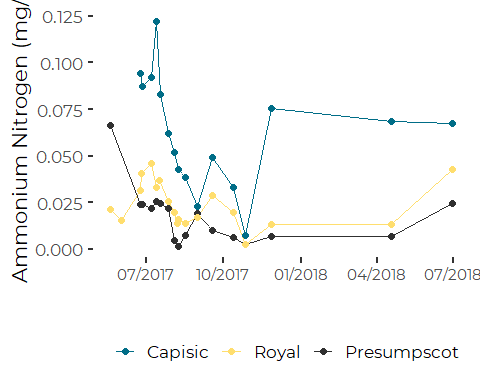

### Organic N

#### Capisic and Royal

``` r
tmp <- the_data %>% 
  filter (tributary != 'Presumpscot') %>%
  select(dt, tributary, organic) %>%
  pivot_wider(names_from = tributary, values_from = organic) %>%
  select(-dt)
cor.test(tmp[[1]], tmp[[2]], use = 'pairwise', method= 'spearman')
#> 
#>  Spearman's rank correlation rho
#> 
#> data:  tmp[[1]] and tmp[[2]]
#> S = 42, p-value < 2.2e-16
#> alternative hypothesis: true rho is not equal to 0
#> sample estimates:
#>       rho 
#> 0.9076923
```

(The other two pairs are clearly not significant)

``` r
plt <- ggplot(the_data, aes(dt, organic, color = tributary)) +
  geom_line()  +
  geom_point(size = 2) +
 scale_color_manual(values=cbep_colors(), name = '') +
 scale_x_date(date_breaks = '3 month', date_labels = '%m/%Y', name = '') +
 theme(legend.position = 'bottom',
        axis.text.x = element_text(size = 11)) +
  ylab('Organic Nitrogen (mg/l)')
plt
#> Warning: Removed 1 row(s) containing missing values (geom_path).
#> Warning: Removed 1 rows containing missing values (geom_point).
```

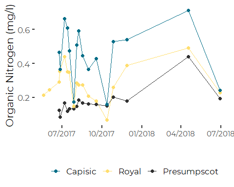

``` r
plt <- the_data %>% 
  filter (tributary != 'Presumpscot') %>%
  select(dt, tributary, organic) %>%
  pivot_wider(names_from = tributary, values_from = organic) %>%
  select(-dt) %>%
  
  ggplot(aes(Capisic, Royal)) +
  geom_point(size = 2, color = cbep_colors()[4]) +
  geom_smooth(method = 'lm', se = FALSE, color = cbep_colors()[3]) +
  
  xlab('Capisic Brook') +
  ylab('Royal River') +
  
  xlim(0, 0.75) +
  ylim(0, 0.5) +
  
  ggtitle('Organic Nitrogen (mg/l)') +
  
  theme_cbep(base_size = 12) +
  theme(title = element_text(size = 8))
plt
#> `geom_smooth()` using formula 'y ~ x'
#> Warning: Removed 7 rows containing non-finite values (stat_smooth).
#> Warning: Removed 7 rows containing missing values (geom_point).
```

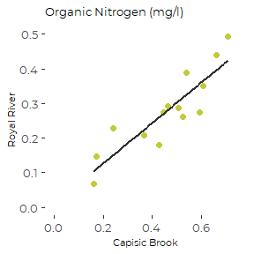

``` r
ggsave('figures/royal-capisic_organic.pdf', device = cairo_pdf, 
       width = 3, height = 3)
#> `geom_smooth()` using formula 'y ~ x'
#> Warning: Removed 7 rows containing non-finite values (stat_smooth).

#> Warning: Removed 7 rows containing missing values (geom_point).
```

(We could explore alternative forms of that model, by transforming
variables, etc., but that is not going to be very informative here with
limited data.)

# Plot Proportion of TN in each category

While a full PCA analysis might be informative, we use a ternary plot to
provide a simple way of evaluating if different rivers show different
forms of nitrogen.

``` r
tmp <- the_data %>%
  mutate(across(nox:organic, ~ .x/tn)) %>%
  filter(! is.na(nox), ! is.na(nh4), ! is.na(organic))
```

## Points Scaled by Rainfall

``` r
tmp <- tmp %>%
  mutate(sz = as.integer(log1p(SumThree)/2) + 1)


TernaryPlot(alab = 'Nitrate', blab = 'Ammonium', clab = 'Organic',
            grid.lines = 5, grid.minor.lines = 0)
TernaryPoints(tmp[4:6], pch = 20, 
              col = cbep_colors()[tmp$tributary],
              cex = tmp$sz)
legend('topright', 
       legend = levels(tmp$tributary),
       box.lty = 0,
       pch = 20,
       col = cbep_colors()[1:3])
```

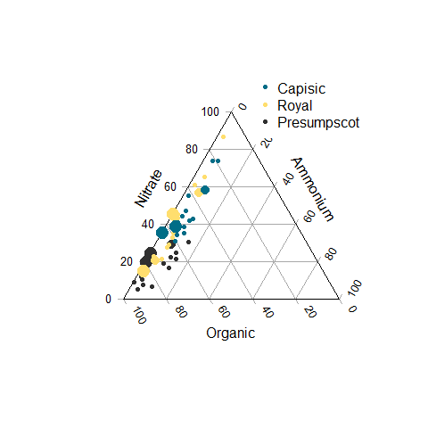

What we see is that for all three rivers, little of the extant nitrogen
is in the form of ammonium. The Presumpscot tends to occur at the low
nitrate, high organic corner of the diagram, while the Royal and Capisic
both show more variability regarding the dominant form of nitrogen. The
proportion of nitrogen in each form is not obviously related to either
recent rainfall or total nitrogen.

## Draft Plot

``` r
TernaryPlot(alab = 'Nitrate', blab = 'Ammonium', clab = 'Organic',
            grid.lines = 5, grid.minor.lines = 0)
TernaryPoints(tmp[4:6], pch = 20, 
              col = cbep_colors()[tmp$tributary])
legend('topright', 
       legend = levels(tmp$tributary),
       box.lty = 0,
       pch = 20,
       col = cbep_colors()[1:3])
```

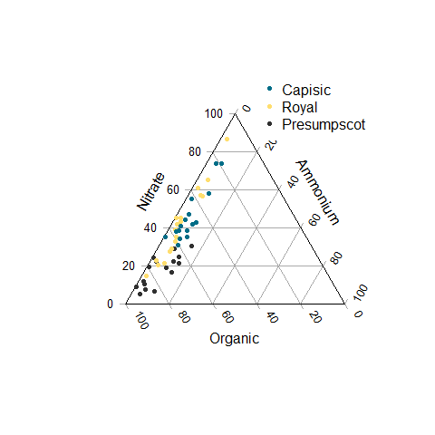

## Produce PDF

We have slightly more control size when we specify the graphics device,
as we can specify fonts and base font size.

``` r
cairo_pdf('figures/ternary.pdf', width = 3.5, height = 3.5,
          family = 'Montserrat', pointsize = 8)
TernaryPlot(alab = 'Nitrate', blab = 'Ammonium', clab = 'Organic',
            grid.lines = 5, grid.minor.lines = 0)
TernaryPoints(tmp[4:6], pch = 20, 
              col = cbep_colors()[tmp$tributary])
legend('topright', 
       legend = levels(tmp$tributary),
       box.lty = 0,
       pch = 20,
       col = cbep_colors()[1:3])
dev.off()
#> png 
#>   2
```

## Produce PNG

``` r
Cairo::Cairo(file = 'figures/ternary.png', width = 400, height = 400,
      type = 'png',
      family = 'Montserrat', pointsize = 9)
TernaryPlot(alab = 'Nitrate', blab = 'Ammonium', clab = 'Organic',
            grid.lines = 5, grid.minor.lines = 0)
TernaryPoints(tmp[4:6], pch = 20, 
              col = cbep_colors()[tmp$tributary])
legend('topright', 
       legend = levels(tmp$tributary),
       box.lty = 0,
       pch = 20,
       col = cbep_colors()[1:3])
```

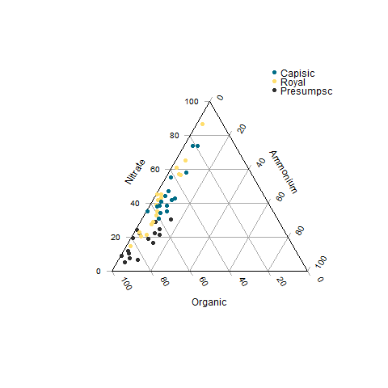

``` r
dev.off()
#> png 
#>   2
```

# Examine Rainfall Correlations

## Total Nitrogen

``` r
tmp <- the_data %>% 
  select(dt, tributary, tn, DayOf, LagOne, SumThree, SumFive) %>%
  pivot_wider(names_from = tributary, values_from = tn) %>%
  select(-dt)
  cc <- cor(tmp, use = "pairwise", method = 'spearman')
  cc[1:4, 5:7]
#>          Presumpscot       Royal     Capisic
#> DayOf     -0.1410329 -0.15878081  0.16808025
#> LagOne     0.4057109 -0.09845132 -0.10239372
#> SumThree   0.5289155  0.10844582  0.01520843
#> SumFive    0.5888847  0.09452913 -0.26877303
```

## Ammonium

``` r
tmp <- the_data %>% 
  select(dt, tributary, nh4, DayOf, LagOne, SumThree, SumFive) %>%
  pivot_wider(names_from = tributary, values_from =nh4) %>%
  select(-dt)
  cc <- cor(tmp, use = "pairwise", method = 'spearman')
  cc[1:4, 5:7]
#>          Presumpscot       Royal    Capisic
#> DayOf     0.09879545 -0.09969958  0.3129770
#> LagOne   -0.08232954 -0.08487183 -0.1294411
#> SumThree -0.33554259 -0.37516390 -0.2298163
#> SumFive  -0.30960258 -0.53061165 -0.3276615
```

## Nitrate

``` r
tmp <- the_data %>% 
  select(dt, tributary, nox, DayOf, LagOne, SumThree, SumFive) %>%
  pivot_wider(names_from = tributary, values_from = nox) %>%
  select(-dt)
  cc <- cor(tmp, use = "pairwise", method = 'spearman')
  cc[1:4, 5:7]
#>          Presumpscot       Royal      Capisic
#> DayOf     -0.1119682 -0.24537230 -0.386391379
#> LagOne     0.2865068  0.02220288 -0.233766784
#> SumThree   0.4015039 -0.01700480  0.064213379
#> SumFive    0.4412150 -0.05532724 -0.004529883
```

## Organic

``` r
tmp <- the_data %>% 
  select(dt, tributary, organic, DayOf, LagOne, SumThree, SumFive) %>%
  pivot_wider(names_from = tributary, values_from = organic) %>%
  select(-dt)
  cc <- cor(tmp, use = "pairwise", method = 'spearman')
  cc[1:4, 5:7]
#>          Presumpscot        Royal    Capisic
#> DayOf     -0.2183111  0.129240191 0.16421634
#> LagOne     0.3438883 -0.115425685 0.18353591
#> SumThree   0.5728509 -0.001953979 0.26699247
#> SumFive    0.6160640 -0.132875859 0.03321914
```

Sample sizes are pretty small, so I would not lean heavily on this, but
it looks like:  
1. Concentrations are not significantly associated with rainfall on the
sample day. 2. Correlations with the one day lag are similar
not-significant, but suggestive.  
3. The Presumpscot shows positive TN correlations that are almost
certainly significant (absent consideration of implicit multiple
comparisons here) with three day and five day sums. Correlations for TN
are driven by stronger correlations with organic N. 4. There is a hint
of a negative association between rainfall in the previous five days and
nitrate on the Royal River, but it is marginally significant, and with
the multiple comparisons involved here, not to be trusted.

# Plot the TN Data By Recent Rainfall

``` r
plt <- ggplot(the_data, aes(SumFive, tn, color = tributary)) + 
  geom_point( ) + 
  geom_smooth(method = 'lm', aes(fill = tributary)) +
  scale_y_log10() +
  ylab("Total Nitrogen (mg/l)") + 
  xlab("Portland Rainfall\nPrevious Five Days (mm)") +
  scale_color_manual(values = cbep_colors(), name = '') +
  scale_fill_manual(values = cbep_colors(), name = '') +  
  scale_x_continuous(trans = 'log1p', breaks = c(0,1, 5, 10, 50)) +
  theme_cbep(base_size = 14) +
  theme(legend.position = 'bottom')
plt
#> `geom_smooth()` using formula 'y ~ x'
#> Warning: Removed 1 rows containing non-finite values (stat_smooth).
#> Warning: Removed 1 rows containing missing values (geom_point).
```

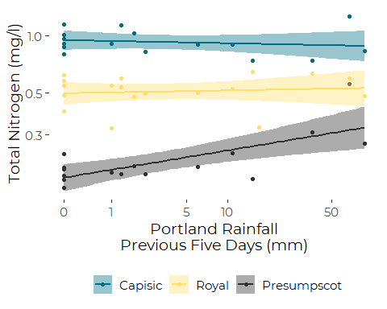

So, what this shows us is that when there’s little or no rainfall over
the prior few day, we’d expect very low N concentrations on the
Presumspcot, but that concentration climbs after rain. Give the limited
number of samples, though, we can’t really tell what shape the
relationship with rainfall may be. From these data, there is a weak
suggestion of elevated nitrogen concentrations only for the highest
recent rainfall values.

# Organic N

``` r
the_lm <- lm(log(organic) ~ log1p(SumFive),
             data = the_data, 
             subset = tributary == 'Presumpscot')
summary(the_lm)
#> 
#> Call:
#> lm(formula = log(organic) ~ log1p(SumFive), data = the_data, 
#>     subset = tributary == "Presumpscot")
#> 
#> Residuals:
#>     Min      1Q  Median      3Q     Max 
#> -0.4346 -0.1995 -0.0427  0.1898  0.6187 
#> 
#> Coefficients:
#>                Estimate Std. Error t value Pr(>|t|)    
#> (Intercept)    -2.02602    0.09227 -21.958 3.02e-12 ***
#> log1p(SumFive)  0.14060    0.04363   3.223  0.00613 ** 
#> ---
#> Signif. codes:  0 '***' 0.001 '**' 0.01 '*' 0.05 '.' 0.1 ' ' 1
#> 
#> Residual standard error: 0.2687 on 14 degrees of freedom
#>   (1 observation deleted due to missingness)
#> Multiple R-squared:  0.4259, Adjusted R-squared:  0.3849 
#> F-statistic: 10.39 on 1 and 14 DF,  p-value: 0.006135
```

(A polynomial fit is not significantly better)

``` r
oldpar <- par(mfrow= c(2,2))
plot(the_lm)
```

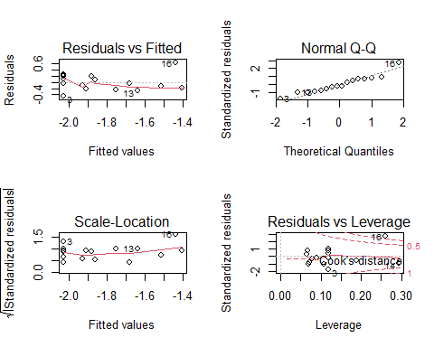

``` r
par(oldpar)
```

That is not ideal. We have a couple of outliers and some high leverage
plots. We try a robust regression.

## Robust Regression

``` r
tmp <- the_data %>%
  filter (tributary == 'Presumpscot') %>%
  filter( ! is.na(organic)) %>%
  mutate(org_log = log(organic),
         five_log1p = log1p(SumFive))
the_mblm <- mblm(org_log ~ five_log1p,
             data = tmp)
summary(the_mblm)
#> Warning in wilcox.test.default(z$intercepts): cannot compute exact p-value with
#> ties

#> Warning in wilcox.test.default(z$intercepts): cannot compute exact p-value with
#> ties
#> 
#> Call:
#> mblm(formula = org_log ~ five_log1p, dataframe = tmp)
#> 
#> Residuals:
#>      Min       1Q   Median       3Q      Max 
#> -0.54569 -0.15860  0.00650  0.08276  0.79489 
#> 
#> Coefficients:
#>             Estimate      MAD V value Pr(>|V|)    
#> (Intercept) -1.91493  0.17712       0 0.000476 ***
#> five_log1p   0.07197  0.04774     136 3.05e-05 ***
#> ---
#> Signif. codes:  0 '***' 0.001 '**' 0.01 '*' 0.05 '.' 0.1 ' ' 1
#> 
#> Residual standard error: 0.2917 on 14 degrees of freedom
```

``` r
oldpar <- par(mfrow= c(2,2))
plot(the_mblm)
```

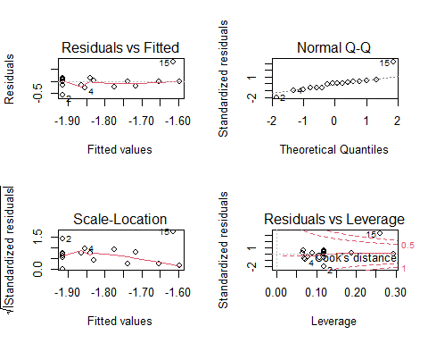

``` r
par(oldpar)
```

``` r
newdat <- tibble(SumFive = seq(0,80,5), five_log1p = log1p(SumFive))
preds <- predict(the_mblm, newdata = newdat)
preds <- newdat %>%
  mutate(preds = preds)
```

``` r
ggplot(tmp, aes(x = five_log1p, y = org_log)) +
  geom_point() +
  geom_line(data = preds, mapping = aes(x = five_log1p, y = preds)) +
  geom_smooth(method = 'lm', se = FALSE)
#> `geom_smooth()` using formula 'y ~ x'
```

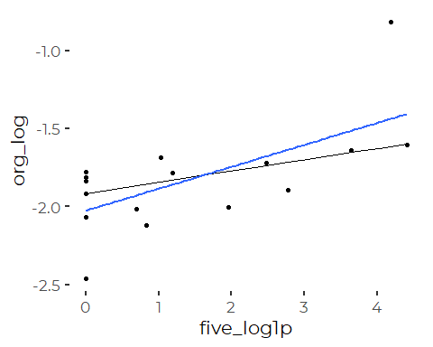

If we are O.K with the linear model, the easiest approach to making
final graphics is to transform both axes and use `geom_smooth()`:

``` r
the_data %>%
  filter(tributary == 'Presumpscot') %>%
  select(organic, SumFive) %>%
    ggplot(aes(SumFive, organic)) +
    geom_point(color = cbep_colors()[5]) +
    geom_smooth( method = 'lm', se = FALSE, color = cbep_colors()[5]) +
    scale_x_continuous(trans = 'log1p',
                       breaks = c(0, 1, 5, 10, 25, 50),
                       labels = scales::comma_format(accuracy = 1)) +
    scale_y_continuous(trans  = 'log10') +
  ylab('Organic Nitrogen (mg/l)') +
  xlab('Five Day Rainfall (mm)') +
 #ggtitle('Presumpscot') +
  theme_cbep(base_size = 12)
#> `geom_smooth()` using formula 'y ~ x'
#> Warning: Removed 1 rows containing non-finite values (stat_smooth).
#> Warning: Removed 1 rows containing missing values (geom_point).
```


``` r
ggsave('figures/organic_fiveday.pdf', device = cairo_pdf, width = 3, height = 3)
#> `geom_smooth()` using formula 'y ~ x'
#> Warning: Removed 1 rows containing non-finite values (stat_smooth).

#> Warning: Removed 1 rows containing missing values (geom_point).
```

``` r
preds <- preds %>%
  mutate(exp_preds = exp(preds))
```

``` r
the_data %>%
  filter(tributary == 'Presumpscot') %>%
  select(organic, SumFive) %>%
    ggplot(aes(SumFive, organic)) +
    geom_point(color = cbep_colors()[1]) +
    geom_line(mapping = aes(SumFive, exp_preds), data = preds, 
              color = cbep_colors()[1]) +
    scale_x_continuous(trans = 'log1p',
                       breaks = c(0, 1, 5, 10, 25, 50),
                       labels = scales::comma_format(accuracy = 1)) +
    scale_y_continuous(trans  = 'log10') +
  ylab('Organic Nitrogen (mg/l)') +
  xlab('Five Day Rainfall (mm)') +
 #ggtitle('Presumpscot') +
  theme_cbep(base_size = 12)
#> Warning: Removed 1 rows containing missing values (geom_point).
```

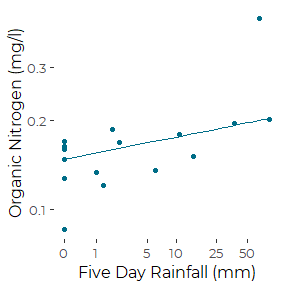

``` r
ggsave('figures/organic_fiveday_mblm.pdf', device = cairo_pdf, width = 3, height = 3)
#> Warning: Removed 1 rows containing missing values (geom_point).
```

## Total N

``` r
the_lm <- lm(log(tn) ~ log1p(SumFive),
             data = the_data, 
             subset = tributary == 'Presumpscot')
summary(the_lm)
#> 
#> Call:
#> lm(formula = log(tn) ~ log1p(SumFive), data = the_data, subset = tributary == 
#>     "Presumpscot")
#> 
#> Residuals:
#>     Min      1Q  Median      3Q     Max 
#> -0.3985 -0.1209 -0.0295  0.0626  0.5660 
#> 
#> Coefficients:
#>                Estimate Std. Error t value Pr(>|t|)    
#> (Intercept)    -1.72863    0.07569 -22.838 1.77e-12 ***
#> log1p(SumFive)  0.13752    0.03579   3.843  0.00179 ** 
#> ---
#> Signif. codes:  0 '***' 0.001 '**' 0.01 '*' 0.05 '.' 0.1 ' ' 1
#> 
#> Residual standard error: 0.2204 on 14 degrees of freedom
#>   (1 observation deleted due to missingness)
#> Multiple R-squared:  0.5133, Adjusted R-squared:  0.4785 
#> F-statistic: 14.76 on 1 and 14 DF,  p-value: 0.001794
```

(A polynomial fit is marginally significantly better (P \~ 0.07))

``` r
oldpar <- par(mfrow= c(2,2))
plot(the_lm)
```

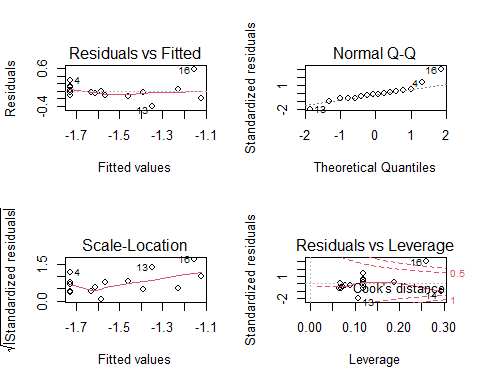

``` r
par(oldpar)
```

That is also not ideal. We again have a couple of outliers and some high
leverage plots. We try a robust regression.

## Robust Regression

``` r
tmp <- the_data %>%
  filter (tributary == 'Presumpscot') %>%
  filter( ! is.na(tn)) %>%
  mutate(tn_log = log(tn),
         five_log1p = log1p(SumFive))
the_mblm <- mblm(tn_log ~ five_log1p,
             data = tmp)
summary(the_mblm)
#> Warning in wilcox.test.default(z$intercepts): cannot compute exact p-value with
#> ties
#> Warning in wilcox.test.default(z$slopes): cannot compute exact p-value with ties
#> Warning in wilcox.test.default(z$intercepts): cannot compute exact p-value with
#> ties
#> Warning in wilcox.test.default(z$slopes): cannot compute exact p-value with ties
#> 
#> Call:
#> mblm(formula = tn_log ~ five_log1p, dataframe = tmp)
#> 
#> Residuals:
#>      Min       1Q   Median       3Q      Max 
#> -0.25704 -0.04955  0.01826  0.08101  0.79368 
#> 
#> Coefficients:
#>             Estimate      MAD V value Pr(>|V|)    
#> (Intercept) -1.70091  0.08035       0 0.000477 ***
#> five_log1p   0.07651  0.07289     122 0.005660 ** 
#> ---
#> Signif. codes:  0 '***' 0.001 '**' 0.01 '*' 0.05 '.' 0.1 ' ' 1
#> 
#> Residual standard error: 0.2508 on 14 degrees of freedom
```

``` r
oldpar <- par(mfrow= c(2,2))
plot(the_mblm)
```

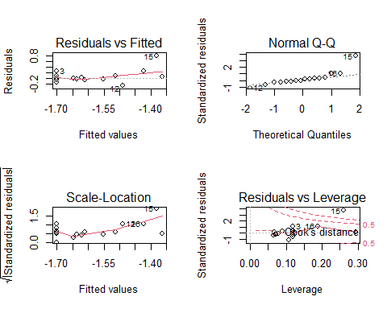

``` r
par(oldpar)
```

``` r
newdat <- tibble(SumFive = seq(0,80,5), five_log1p = log1p(SumFive))
preds <- predict(the_mblm, newdata = newdat)
preds <- newdat %>%
  mutate(preds = preds)
```

``` r
ggplot(tmp, aes(x = five_log1p, y = tn_log)) +
  geom_point() +
  geom_line(data = preds, mapping = aes(x = five_log1p, y = preds)) +
  geom_smooth(method = 'lm', se = FALSE)
#> `geom_smooth()` using formula 'y ~ x'
```

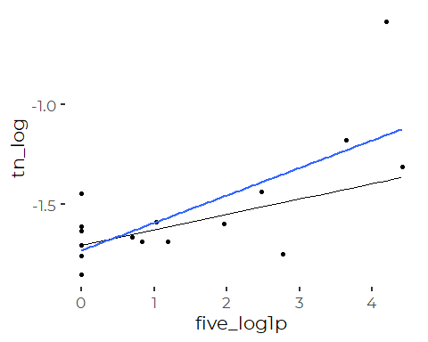
Here, the Robust Regression is better, despite the outlier, but that
requires me to figure out how to adjust the axes, using break and
labeling functions.

## Graphics

### Linear Model

Here’s the default version, using the linear model via `geom_smooth()`.
Note that since we are modeling two transformed variables, we need to
specify a transformation on each axis. The `ggplot2` function
`geom_smooth()` generates a smoothed fit **after** all transforms are
applied.

``` r
tmp %>%
  select(tn, SumFive) %>%
    ggplot(aes(SumFive, tn)) +
    geom_point(color = cbep_colors()[5]) +
    geom_smooth(method = 'lm', se = FALSE,color = cbep_colors()[5]) +
    scale_x_continuous(trans = 'log1p',
                        breaks = c(0, 1, 5, 10, 25, 50),
                        labels = scales::comma_format(accuracy = 1)) +
    scale_y_continuous(trans  = 'log10') +
  ylab('Total Nitrogen (mg/l)') +
  xlab('Five Day Rainfall (mm)') +
 #ggtitle('Presumpscot') +
  theme_cbep(base_size = 12)
#> `geom_smooth()` using formula 'y ~ x'
```

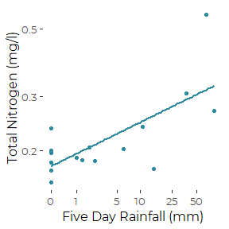

``` r
ggsave('figures/tn_fiveday_lm.pdf', device = cairo_pdf, width = 3, height = 3)
#> `geom_smooth()` using formula 'y ~ x'
```

### Robust Regression

We develop an alternative version, using the results of the robust
linear model.

The challenge here is that we ran the analysis on transformed variables.
We want to signal that to the reader by showing transformed axes, but
with labels that correspond to untransformed variables. (That is, the
axes should look like the ones we just produced.)

There are several ways we could proceed:

1.  Back transform coordinates of our prediction and then transform the
    axes again for display.  
2.  Plot on transformed axes, and then relabel those axes with
    untransformed labels.  
3.  A combination of the two, where we use one strategy on one axis, and
    another on the other axis.

#### Back transformed predictions

Because we can directly plot both a log axis and a log(X+1) axis, the
back transform here is simplest.

``` r
preds <- preds %>%
  mutate(exp_preds = exp(preds))
```

``` r
the_data %>%
  filter(tributary == 'Presumpscot') %>%
  select(tn, SumFive) %>%
    ggplot(aes(SumFive, tn)) +
    geom_point(color = cbep_colors()[6]) +
    geom_line(mapping = aes(SumFive, exp_preds), data = preds, 
              color = cbep_colors()[6]) +
    scale_x_continuous(trans = 'log1p',
                       breaks = c(0, 1, 5, 10, 25, 50),
                       labels = scales::comma_format(accuracy = 1)) +
    scale_y_continuous(trans  = 'log10') +
  ylab('Total Nitrogen (mg/l)') +
  xlab('Five Day Rainfall (mm)') +
 #ggtitle('Presumpscot') +
  theme_cbep(base_size = 12)
#> Warning: Removed 1 rows containing missing values (geom_point).
```

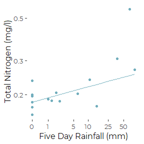

``` r
ggsave('figures/tn_fiveday_mblm.pdf', device = cairo_pdf, width = 3, height = 3)
#> Warning: Removed 1 rows containing missing values (geom_point).
```
