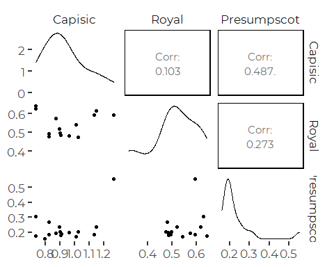
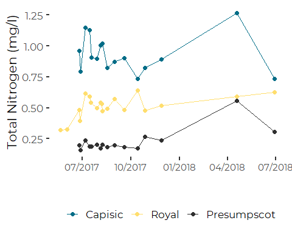
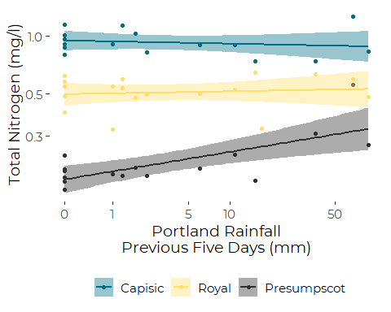

Tributary Nitrogen Concentrations and Rainfall
================
Curtis C. Bohlen, Casco Bay Estuary Partnership.
04/22/2021

-   [Install Libraries](#install-libraries)
-   [Read Data](#read-data)
-   [Rainfall Data](#rainfall-data)
    -   [Add Lagged terms](#add-lagged-terms)
    -   [Merge Data Together](#merge-data-together)
-   [Correlation Between Rivers by
    Date](#correlation-between-rivers-by-date)
    -   [Examine Rainfall Correlations](#examine-rainfall-correlations)
        -   [And rank correlations](#and-rank-correlations)
-   [Plot the TN Data By Recent
    Rainfall](#plot-the-tn-data-by-recent-rainfall)


# Install Libraries

``` r
library(readxl)
library(readr)
library(tidyverse)
#> -- Attaching packages --------------------------------------- tidyverse 1.3.0 --
#> v ggplot2 3.3.3     v dplyr   1.0.3
#> v tibble  3.0.5     v stringr 1.4.0
#> v tidyr   1.1.2     v forcats 0.5.0
#> v purrr   0.3.4
#> -- Conflicts ------------------------------------------ tidyverse_conflicts() --
#> x dplyr::filter() masks stats::filter()
#> x dplyr::lag()    masks stats::lag()
library(GGally)
#> Registered S3 method overwritten by 'GGally':
#>   method from   
#>   +.gg   ggplot2

library(CBEPgraphics)
load_cbep_fonts()
theme_set(theme_cbep())
```

# Read Data

``` r
sibfldnm <- 'Original_Data'
parent <- dirname(getwd())
sibling <- paste(parent,sibfldnm, sep = '/')
fn <- '2017-18 Casco Bay Tributary Nitrogen Concentrations.xlsx'

dir.create(file.path(getwd(), 'figures'), showWarnings = FALSE)
```

``` r
the_data <- read_excel(file.path(sibling, fn), 
                       col_types = c("date", "numeric", "numeric", 
                                     "numeric", "numeric"), skip = 1) %>%
  filter( ! is.na(Date)) %>%
  rename(dt = Date,
         tn = `TN (mg/l)`,
         nox = `NOx (mg/L)`,
         nh4 = `NH4 (mg/L)`,
         organic = `Organic (mg/L)`) %>%
  mutate(dt = as.Date(dt))
```

``` r
the_data$tributary <- c(rep('Presumpscot',17), 
                        rep('Royal', 19), 
                        rep('Capisic', 16))
the_data <- the_data %>%
  relocate(tributary) %>%
  mutate(tributary = factor(tributary, levels = c('Capisic', 'Royal', 'Presumpscot')))
```

# Rainfall Data

Downloaded rainfall data is in tenths of millimeters.

``` r
rain_data <- read_csv(file.path(sibling, 'portland_weather5_17-8_18.csv'),
                      col_types = cols(
                        .default = col_skip(),
                        date = col_date(format = ""),
                        PRCP = col_double())) %>%
  mutate(PRCP = PRCP / 10)
```

## Add Lagged terms

``` r
rain_data <- rain_data %>% mutate(LagOne   = lag(PRCP),
                             SumThree = reduce(map(1:3, ~lag(PRCP, ., 0)), `+`),
                             SumFive  = reduce(map(1:5, ~lag(PRCP, ., 0)), `+`))
```

## Merge Data Together

Lagged functions generate either nonsense or NAs, but only for the first
few days of the rain\_data. Here we don’t call on any of those days, so
we can use the data “as is” without worrying.

Notice the use of “match” here to gather exact date matches. This allows
something very much like a lookup table.

``` r
the_data <- the_data %>% 
  mutate(DayOf = rain_data$PRCP[match(the_data$dt, rain_data$date)],
         LagOne = rain_data$LagOne[match(the_data$dt, rain_data$date)],
         SumThree =  rain_data$SumThree[match(the_data$dt, rain_data$date)],
         SumFive = rain_data$SumFive[match(the_data$dt, rain_data$date)])
rm(rain_data)
```

# Correlation Between Rivers by Date

``` r
tmp <- the_data %>% select(dt, tributary, tn) %>%
  spread(tributary, tn) %>% select(-1)
  cor(tmp, use = "p")
#>               Capisic     Royal Presumpscot
#> Capisic     1.0000000 0.1027375   0.4867812
#> Royal       0.1027375 1.0000000   0.2728884
#> Presumpscot 0.4867812 0.2728884   1.0000000
  cor(tmp, use = "p", method = 's')
#>                 Capisic       Royal Presumpscot
#> Capisic      1.00000000 -0.07252747  0.20294118
#> Royal       -0.07252747  1.00000000 -0.01098901
#> Presumpscot  0.20294118 -0.01098901  1.00000000
```

``` r
plt <- ggpairs(tmp)
plt
#> Warning: Removed 5 rows containing non-finite values (stat_density).
#> Warning in ggally_statistic(data = data, mapping = mapping, na.rm = na.rm, :
#> Removed 7 rows containing missing values
#> Warning in ggally_statistic(data = data, mapping = mapping, na.rm = na.rm, :
#> Removed 5 rows containing missing values
#> Warning: Removed 7 rows containing missing values (geom_point).
#> Warning: Removed 2 rows containing non-finite values (stat_density).
#> Warning in ggally_statistic(data = data, mapping = mapping, na.rm = na.rm, :
#> Removed 7 rows containing missing values
#> Warning: Removed 5 rows containing missing values (geom_point).
#> Warning: Removed 7 rows containing missing values (geom_point).
#> Warning: Removed 5 rows containing non-finite values (stat_density).
```


So, the apparent correlations across sites are pretty wobbly….

``` r
plt <- ggplot(the_data, aes(dt, tn, color = tributary)) +
  geom_line()  +
  geom_point(size = 2) +
  scale_color_manual(values=cbep_colors(), name = '') +
  scale_x_date(date_breaks = '3 month', date_labels = '%m/%Y', name = '') +
  theme(legend.position = 'bottom',
        axis.text.x = element_text(size = 11)) +
  ylab('Total Nitrogen (mg/l)')
plt
#> Warning: Removed 1 row(s) containing missing values (geom_path).
#> Warning: Removed 1 rows containing missing values (geom_point).
```



## Examine Rainfall Correlations

``` r
tmp <- the_data %>% 
  select(dt, tributary, tn, DayOf, LagOne, SumThree, SumFive) %>%
  pivot_wider(names_from = tributary, values_from = tn) %>%
  select(-dt)
  cor(tmp, use = "p")
#>                   DayOf     LagOne    SumThree     SumFive Presumpscot
#> DayOf        1.00000000 -0.1180710 -0.14673164 -0.16918972  -0.1868738
#> LagOne      -0.11807095  1.0000000  0.75835861  0.74329158   0.2317418
#> SumThree    -0.14673164  0.7583586  1.00000000  0.98492455   0.7316442
#> SumFive     -0.16918972  0.7432916  0.98492455  1.00000000   0.7304968
#> Presumpscot -0.18687380  0.2317418  0.73164421  0.73049680   1.0000000
#> Royal       -0.11195560  0.1041131  0.09775041  0.14650570   0.2728884
#> Capisic     -0.07974316 -0.3708875  0.09840731  0.03666021   0.4867812
#>                   Royal     Capisic
#> DayOf       -0.11195560 -0.07974316
#> LagOne       0.10411315 -0.37088745
#> SumThree     0.09775041  0.09840731
#> SumFive      0.14650570  0.03666021
#> Presumpscot  0.27288843  0.48678118
#> Royal        1.00000000  0.10273751
#> Capisic      0.10273751  1.00000000
```

### And rank correlations

``` r
  cor(tmp, use = "p", method = "s")
#>                   DayOf      LagOne   SumThree     SumFive Presumpscot
#> DayOf        1.00000000  0.05503650 0.06806323 -0.13795348 -0.14103285
#> LagOne       0.05503650  1.00000000 0.76449687  0.55373137  0.40571095
#> SumThree     0.06806323  0.76449687 1.00000000  0.75933087  0.52891547
#> SumFive     -0.13795348  0.55373137 0.75933087  1.00000000  0.58888473
#> Presumpscot -0.14103285  0.40571095 0.52891547  0.58888473  1.00000000
#> Royal       -0.15878081 -0.09845132 0.10844582  0.09452913 -0.01098901
#> Capisic      0.16808025 -0.10239372 0.01520843 -0.26877303  0.20294118
#>                   Royal     Capisic
#> DayOf       -0.15878081  0.16808025
#> LagOne      -0.09845132 -0.10239372
#> SumThree     0.10844582  0.01520843
#> SumFive      0.09452913 -0.26877303
#> Presumpscot -0.01098901  0.20294118
#> Royal        1.00000000 -0.07252747
#> Capisic     -0.07252747  1.00000000
  cor(tmp, use = "p", method = "k")
#>                   DayOf      LagOne   SumThree     SumFive Presumpscot
#> DayOf        1.00000000  0.04134491 0.05140424 -0.11534996 -0.12422600
#> LagOne       0.04134491  1.00000000 0.72756230  0.48824008  0.32298760
#> SumThree     0.05140424  0.72756230 1.00000000  0.68732520  0.41109610
#> SumFive     -0.11534996  0.48824008 0.68732520  1.00000000  0.43652670
#> Presumpscot -0.12422600  0.32298760 0.41109610  0.43652670  1.00000000
#> Royal       -0.12330725 -0.06839856 0.07844147  0.06162282 -0.01098901
#> Capisic      0.12422600 -0.04969040 0.01054093 -0.22271770  0.15000000
#>                   Royal     Capisic
#> DayOf       -0.12330725  0.12422600
#> LagOne      -0.06839856 -0.04969040
#> SumThree     0.07844147  0.01054093
#> SumFive      0.06162282 -0.22271770
#> Presumpscot -0.01098901  0.15000000
#> Royal        1.00000000 -0.05494505
#> Capisic     -0.05494505  1.00000000
```

Sample sizes are pretty small, so I would not lean heavily on this, but
it looks like:  
1. Concentrations are largely independent of rainfall on the sample day,
perhaps because much of that rainfall may have fallen after the sample
was drawn. At least, correlation coefficients are low enough that I
would not want to push the idea on these data alone.  
2. I see few correlations with the one day lag.  
3. The Presumpscot shows positive correlations with precipitation, lag
one, and the three day and five day sums.

# Plot the TN Data By Recent Rainfall

``` r
plt <- ggplot(the_data, aes(SumFive, tn, color = tributary)) + 
  geom_point( ) + 
  geom_smooth(method = 'lm', aes(fill = tributary)) +
  scale_y_log10() +
  ylab("Total Nitrogen (mg/l)") + 
  xlab("Portland Rainfall\nPrevious Five Days (mm)") +
  scale_color_manual(values = cbep_colors(), name = '') +
  scale_fill_manual(values = cbep_colors(), name = '') +  
  scale_x_continuous(trans = 'log1p', breaks = c(0,1, 5, 10, 50)) +
  theme_cbep(base_size = 14) +
  theme(legend.position = 'bottom')
plt
#> `geom_smooth()` using formula 'y ~ x'
#> Warning: Removed 1 rows containing non-finite values (stat_smooth).
#> Warning: Removed 1 rows containing missing values (geom_point).
```



So, what this shows us is that when there’s little or no rainfall over
the prior few day, we’d expect very low N concentrations on the
Presumscot, but that concentration climbs after rain. Give the limited
number of samples, though, we can’t really tell what shape the
relationship with rainfall may be. From these data, there is a weak
suggestion of elevated nitrogen concentrations only for the highest
recent rainfal lvalues.
