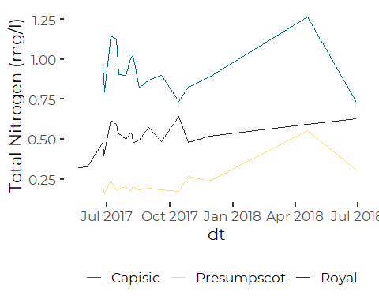

Review and Reorganization of Whitley Gray’s Tributary Nitrogen Data
================
Curtis C. Bohlen, Casco Bay Estuary Partnership.
04/22/2021

-   [Install Libraries](#install-libraries)
-   [Read Data](#read-data)
-   [Initial Graphic](#initial-graphic)


# Install Libraries

``` r
library(readxl)
library(tidyverse)
#> -- Attaching packages --------------------------------------- tidyverse 1.3.0 --
#> v ggplot2 3.3.3     v purrr   0.3.4
#> v tibble  3.0.5     v dplyr   1.0.3
#> v tidyr   1.1.2     v stringr 1.4.0
#> v readr   1.4.0     v forcats 0.5.0
#> -- Conflicts ------------------------------------------ tidyverse_conflicts() --
#> x dplyr::filter() masks stats::filter()
#> x dplyr::lag()    masks stats::lag()
library(GGally)
#> Registered S3 method overwritten by 'GGally':
#>   method from   
#>   +.gg   ggplot2

library(CBEPgraphics)
load_cbep_fonts()
theme_set(theme_cbep())
```

# Read Data

``` r
sibfldnm <- 'Original_Data'
parent <- dirname(getwd())
sibling <- paste(parent,sibfldnm, sep = '/')
fn <- '2017-18 Casco Bay Tributary Nitrogen Concentrations.xlsx'
```

``` r
the_data <- read_excel(file.path(sibling, fn), 
                       col_types = c("date", "numeric", "numeric", 
                                     "numeric", "numeric"), skip = 1) %>%
  filter( ! is.na(Date)) %>%
  rename(dt = Date,
         tn = `TN (mg/l)`,
         nox = `NOx (mg/L)`,
         nh4 = `NH4 (mg/L)`,
         organic = `Organic (mg/L)`)
#> Warning in read_fun(path = enc2native(normalizePath(path)), sheet_i = sheet, :
#> Expecting date in A21 / R21C1: got 'Royal'
#> Warning in read_fun(path = enc2native(normalizePath(path)), sheet_i = sheet, :
#> Expecting date in A22 / R22C1: got 'Date'
#> Warning in read_fun(path = enc2native(normalizePath(path)), sheet_i = sheet, :
#> Expecting numeric in B22 / R22C2: got 'TN (mg/l)'
#> Warning in read_fun(path = enc2native(normalizePath(path)), sheet_i = sheet, :
#> Expecting numeric in C22 / R22C3: got 'NOx (mg/L)'
#> Warning in read_fun(path = enc2native(normalizePath(path)), sheet_i = sheet, :
#> Expecting numeric in D22 / R22C4: got 'NH4 (mg/L)'
#> Warning in read_fun(path = enc2native(normalizePath(path)), sheet_i = sheet, :
#> Expecting numeric in E22 / R22C5: got 'Organic (mg/L)'
#> Warning in read_fun(path = enc2native(normalizePath(path)), sheet_i = sheet, :
#> Expecting date in A43 / R43C1: got 'Capisic'
#> Warning in read_fun(path = enc2native(normalizePath(path)), sheet_i = sheet, :
#> Expecting date in A44 / R44C1: got 'Date'
#> Warning in read_fun(path = enc2native(normalizePath(path)), sheet_i = sheet, :
#> Expecting numeric in B44 / R44C2: got 'TN (mg/l)'
#> Warning in read_fun(path = enc2native(normalizePath(path)), sheet_i = sheet, :
#> Expecting numeric in C44 / R44C3: got 'NOx (mg/L)'
#> Warning in read_fun(path = enc2native(normalizePath(path)), sheet_i = sheet, :
#> Expecting numeric in D44 / R44C4: got 'NH4 (mg/L)'
#> Warning in read_fun(path = enc2native(normalizePath(path)), sheet_i = sheet, :
#> Expecting numeric in E44 / R44C5: got 'Organic (mg/L)'
```

``` r
the_data$tributary <- c(rep('Presumpscot',17), rep('Royal', 19), rep('Capisic', 16))
the_data <- the_data %>%
  relocate(tributary)
```

# Initial Graphic

``` r
ggplot(the_data, aes(dt, tn, color = tributary)) +
  geom_line() +
  scale_color_manual(values = cbep_colors(), name = '') +
  ylab("Total Nitrogen (mg/l)") +
  
  theme(legend.position = 'bottom')
#> Warning: Removed 1 row(s) containing missing values (geom_path).
```



``` r
  xlab('Date')
#> $x
#> [1] "Date"
#> 
#> attr(,"class")
#> [1] "labels"
```
