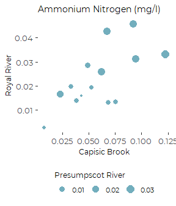
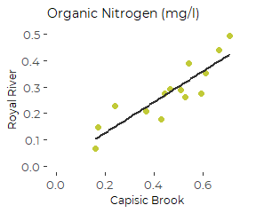
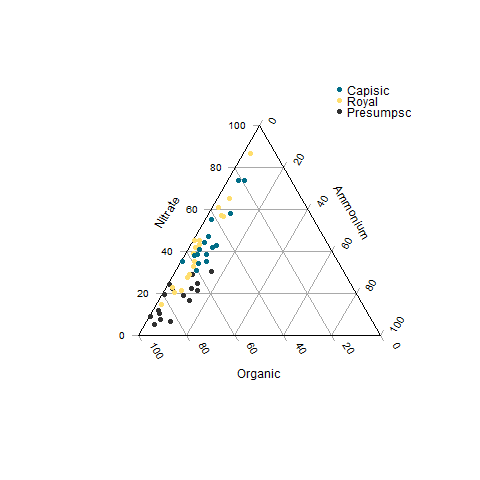
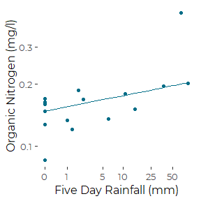
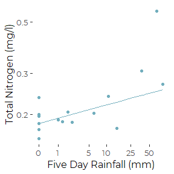

Tributary Nitrogen Concentrations and Rainfall
================
Curtis C. Bohlen, Casco Bay Estuary Partnership.
04/22/2021

-   [Install Libraries](#install-libraries)
-   [Read Data](#read-data)
-   [Rainfall Data](#rainfall-data)
    -   [Add Lagged Terms](#add-lagged-terms)
    -   [Merge Data](#merge-data)
-   [Correlation Between Rivers by
    Date](#correlation-between-rivers-by-date)
    -   [Ammonium](#ammonium)
    -   [Organic N](#organic-n)
-   [Plot Proportion of TN in each
    category](#plot-proportion-of-tn-in-each-category)
    -   [Produce PNG](#produce-png)
    -   [Produce PDF](#produce-pdf)
-   [Examine Rainfall Correlations](#examine-rainfall-correlations)
    -   [Total Nitrogen](#total-nitrogen)
    -   [Ammonium](#ammonium-1)
    -   [Nitrate](#nitrate)
    -   [Organic](#organic)
-   [Organic N](#organic-n-1)
    -   [Robust Regression](#robust-regression)
-   [Total N](#total-n)
    -   [Robust Regression](#robust-regression-1)


# Install Libraries

``` r
library(readxl)
library(readr)
library(tidyverse)
#> -- Attaching packages --------------------------------------- tidyverse 1.3.0 --
#> v ggplot2 3.3.3     v dplyr   1.0.3
#> v tibble  3.0.5     v stringr 1.4.0
#> v tidyr   1.1.2     v forcats 0.5.0
#> v purrr   0.3.4
#> -- Conflicts ------------------------------------------ tidyverse_conflicts() --
#> x dplyr::filter() masks stats::filter()
#> x dplyr::lag()    masks stats::lag()

library(GGally)
#> Registered S3 method overwritten by 'GGally':
#>   method from   
#>   +.gg   ggplot2
library(Ternary) # Base graphics ternary plots
#> Warning: package 'Ternary' was built under R version 4.0.5

library(mblm)    # For median based (robust) linear models

library(CBEPgraphics)
load_cbep_fonts()
theme_set(theme_cbep())
```

# Read Data

``` r
sibfldnm <- 'Original_Data'
parent <- dirname(getwd())
sibling <- paste(parent,sibfldnm, sep = '/')
fn <- '2017-18 Casco Bay Tributary Nitrogen Concentrations.xlsx'

dir.create(file.path(getwd(), 'figures'), showWarnings = FALSE)
```

``` r
the_data <- read_excel(file.path(sibling, fn), 
                       col_types = c("date", "numeric", "numeric", 
                                     "numeric", "numeric"), skip = 1) %>%
  filter( ! is.na(Date)) %>%
  rename(dt = Date,
         tn = `TN (mg/l)`,
         nox = `NOx (mg/L)`,
         nh4 = `NH4 (mg/L)`,
         organic = `Organic (mg/L)`) %>%
  mutate(dt = as.Date(dt))
```

``` r
the_data$tributary <- c(rep('Presumpscot',17), 
                        rep('Royal', 19), 
                        rep('Capisic', 16))
the_data <- the_data %>%
  relocate(tributary) %>%
  mutate(tributary = factor(tributary, levels = c('Capisic', 'Royal', 'Presumpscot')))
```

# Rainfall Data

Downloaded rainfall data is in tenths of millimeters. We convert to
millimeters.

``` r
rain_data <- read_csv(file.path(sibling, 'portland_weather5_17-8_18.csv'),
                      col_types = cols(
                        .default = col_skip(),
                        date = col_date(format = ""),
                        PRCP = col_double())) %>%
  mutate(PRCP = PRCP / 10)
```

## Add Lagged Terms

The code uses `reduce()`, which applies a function sequentially to items
in a list. The list here is generated using `map()` to pull prior
observations using (the `dplyr` version ) of `lag()`. The reduce step
adds them together to produce a cumulative sum.

``` r
rain_data <- rain_data %>% mutate(LagOne   = lag(PRCP),
                             SumThree = reduce(map(1:3, ~lag(PRCP, ., 0)), `+`),
                             SumFive  = reduce(map(1:5, ~lag(PRCP, ., 0)), `+`))
```

## Merge Data

Lagged functions generate either nonsense or NAs for the first few days
of the rain\_data. However, we downloaded data starting well before any
of the dates when data was collected. We can use the data “as is”
without worrying about reading in values that don’t really include
information from one, three, or five days.

We use of `match()` here to gather exact date matches. This allows
something like a lookup table in Base R. A Tidyverse alternative would
be to use `left_join()`, which is a bit easier to parse, but this was
legacy code, and not worth revising.

``` r
the_data <- the_data %>% 
  mutate(DayOf = rain_data$PRCP[match(the_data$dt, rain_data$date)],
         LagOne = rain_data$LagOne[match(the_data$dt, rain_data$date)],
         SumThree =  rain_data$SumThree[match(the_data$dt, rain_data$date)],
         SumFive = rain_data$SumFive[match(the_data$dt, rain_data$date)])
rm(rain_data)
```

# Correlation Between Rivers by Date

If rainfall is important in shaping river nitrogen loads, then we might
expect concentrations of nitrogen to be correlated across rivers. We
check for that (somewhat informally) here.

With an effective sample size of only sixteen observations on matching
dates from all sites (sometimes 17 for certain pairs), the critical
correlation coefficient is on the order of 0.5 at p \~ 0.05.

Because nitrogen data are often highly skewed, rank correlations are
preferable. These tests should be considered preliminary, as they do not
consider temporal autocorrelations which may be important. Data,
however, is too sparse to allow rigorous checking of its importance.

## Ammonium

``` r
tmp <- the_data %>% select(dt, tributary, nh4) %>%
  pivot_wider(names_from = tributary, values_from = nh4) %>%
  select(-dt)
  cor(tmp, use = "pairwise", method = 'spearman')
#>             Presumpscot     Royal   Capisic
#> Presumpscot   1.0000000 0.7178571 0.6911765
#> Royal         0.7178571 1.0000000 0.5296703
#> Capisic       0.6911765 0.5296703 1.0000000
```

``` r
plt <- the_data %>% 
  select(dt, tributary, nh4) %>%
  pivot_wider(names_from = tributary, values_from = nh4) %>%
  select(-dt) %>%

ggplot( aes(Capisic, Royal, size = Presumpscot)) +
  geom_point(color = cbep_colors()[6]) +
  scale_size(breaks = 0.01 * 1:3) +
 
  ggtitle('Ammonium Nitrogen (mg/l)') +
  xlab('Capisic Brook') +
  ylab('Royal River') +
    
  theme_cbep(base_size = 12) +
  theme(legend.position = 'bottom',
        title = element_text(size = 9),
        legend.text = element_text(size = 8)) +
  guides(size = guide_legend(title = 'Presumpscot River', title.position = 'top'))
plt
#> Warning: Removed 7 rows containing missing values (geom_point).
```



``` r
ggsave('figures/ammonium_correlations.pdf', device = cairo_pdf, width = 3, height = 3.5)
#> Warning: Removed 7 rows containing missing values (geom_point).
```

## Organic N

``` r
tmp <- the_data %>% select(dt, tributary, organic) %>%
  pivot_wider(names_from = tributary, values_from = organic) %>%
  select(-dt)
  cor(tmp, use = "pairwise", method = 'spearman')
#>             Presumpscot     Royal   Capisic
#> Presumpscot   1.0000000 0.2263736 0.3441176
#> Royal         0.2263736 1.0000000 0.9076923
#> Capisic       0.3441176 0.9076923 1.0000000
```

``` r
plt <- the_data %>% 
  filter (tributary != 'Presumpscot') %>%
  select(dt, tributary, organic) %>%
  pivot_wider(names_from = tributary, values_from = organic) %>%
  select(-dt) %>%
  
  ggplot(aes(Capisic, Royal)) +
  geom_point(size = 2, color = cbep_colors()[4]) +
  geom_smooth(method = 'lm', se = FALSE, color = cbep_colors()[3]) +
  
  xlab('Capisic Brook') +
  ylab('Royal River') +
  
  xlim(0, 0.75) +
  ylim(0, 0.5) +
  
  ggtitle('Organic Nitrogen (mg/l)') +
  
  theme_cbep(base_size = 12) +
  theme(title = element_text(size = 9))
plt
#> `geom_smooth()` using formula 'y ~ x'
#> Warning: Removed 7 rows containing non-finite values (stat_smooth).
#> Warning: Removed 7 rows containing missing values (geom_point).
```



``` r
ggsave('figures/royal-capisic_organic.pdf', device = cairo_pdf, 
       width = 3, height = 2.75)
#> `geom_smooth()` using formula 'y ~ x'
#> Warning: Removed 7 rows containing non-finite values (stat_smooth).

#> Warning: Removed 7 rows containing missing values (geom_point).
```

# Plot Proportion of TN in each category

We use a ternary plot to provide a simple way of evaluating if different
rivers show different forms of nitrogen.

``` r
tmp <- the_data %>%
  mutate(across(nox:organic, ~ .x/tn)) %>%
  filter(! is.na(nox), ! is.na(nh4), ! is.na(organic))
```

## Produce PNG

``` r
Cairo::Cairo(file = 'figures/ternary.png', width = 400, height = 400,
      type = 'png',
      family = 'Montserrat', pointsize = 9)
TernaryPlot(alab = 'Nitrate', blab = 'Ammonium', clab = 'Organic',
            grid.lines = 5, grid.minor.lines = 0)
TernaryPoints(tmp[4:6], pch = 20, 
              col = cbep_colors()[tmp$tributary])
legend('topright', 
       legend = levels(tmp$tributary),
       box.lty = 0,
       pch = 20,
       col = cbep_colors()[1:3])
```



``` r
dev.off()
#> png 
#>   2
```

## Produce PDF

We have slightly more control size when we specify the graphics device,
as we can specify fonts and base font size.

``` r
cairo_pdf('figures/ternary.pdf', width = 3.5, height = 3.5,
          family = 'Montserrat', pointsize = 8)
TernaryPlot(alab = 'Nitrate', blab = 'Ammonium', clab = 'Organic',
            grid.lines = 5, grid.minor.lines = 0)
TernaryPoints(tmp[4:6], pch = 20, 
              col = cbep_colors()[tmp$tributary])
legend('topright', 
       legend = levels(tmp$tributary),
       box.lty = 0,
       pch = 20,
       col = cbep_colors()[1:3])
dev.off()
#> png 
#>   2
```

# Examine Rainfall Correlations

## Total Nitrogen

``` r
tmp <- the_data %>% 
  select(dt, tributary, tn, DayOf, LagOne, SumThree, SumFive) %>%
  pivot_wider(names_from = tributary, values_from = tn) %>%
  select(-dt)
  cc <- cor(tmp, use = "pairwise", method = 'spearman')
  cc[1:4, 5:7]
#>          Presumpscot       Royal     Capisic
#> DayOf     -0.1410329 -0.15878081  0.16808025
#> LagOne     0.4057109 -0.09845132 -0.10239372
#> SumThree   0.5289155  0.10844582  0.01520843
#> SumFive    0.5888847  0.09452913 -0.26877303
```

## Ammonium

``` r
tmp <- the_data %>% 
  select(dt, tributary, nh4, DayOf, LagOne, SumThree, SumFive) %>%
  pivot_wider(names_from = tributary, values_from =nh4) %>%
  select(-dt)
  cc <- cor(tmp, use = "pairwise", method = 'spearman')
  cc[1:4, 5:7]
#>          Presumpscot       Royal    Capisic
#> DayOf     0.09879545 -0.09969958  0.3129770
#> LagOne   -0.08232954 -0.08487183 -0.1294411
#> SumThree -0.33554259 -0.37516390 -0.2298163
#> SumFive  -0.30960258 -0.53061165 -0.3276615
```

## Nitrate

``` r
tmp <- the_data %>% 
  select(dt, tributary, nox, DayOf, LagOne, SumThree, SumFive) %>%
  pivot_wider(names_from = tributary, values_from = nox) %>%
  select(-dt)
  cc <- cor(tmp, use = "pairwise", method = 'spearman')
  cc[1:4, 5:7]
#>          Presumpscot       Royal      Capisic
#> DayOf     -0.1119682 -0.24537230 -0.386391379
#> LagOne     0.2865068  0.02220288 -0.233766784
#> SumThree   0.4015039 -0.01700480  0.064213379
#> SumFive    0.4412150 -0.05532724 -0.004529883
```

## Organic

``` r
tmp <- the_data %>% 
  select(dt, tributary, organic, DayOf, LagOne, SumThree, SumFive) %>%
  pivot_wider(names_from = tributary, values_from = organic) %>%
  select(-dt)
  cc <- cor(tmp, use = "pairwise", method = 'spearman')
  cc[1:4, 5:7]
#>          Presumpscot        Royal    Capisic
#> DayOf     -0.2183111  0.129240191 0.16421634
#> LagOne     0.3438883 -0.115425685 0.18353591
#> SumThree   0.5728509 -0.001953979 0.26699247
#> SumFive    0.6160640 -0.132875859 0.03321914
```

So, what this shows us is that when there’s little or no rainfall over
the prior few day, we’d expect very low N concentrations on the
Presumscot, but that concentration climbs after rain. Give the limited
number of samples, though, we can’t really tell what shape the
relationship with rainfall may be. From these data, there is a weak
suggestion of elevated nitrogen concentrations only for the highest
recent rainfall values.

# Organic N

## Robust Regression

``` r
tmp <- the_data %>%
  filter (tributary == 'Presumpscot') %>%
  filter( ! is.na(organic)) %>%
  mutate(org_log = log(organic),
         five_log1p = log1p(SumFive))
the_mblm <- mblm(org_log ~ five_log1p,
             data = tmp)
summary(the_mblm)
#> Warning in wilcox.test.default(z$intercepts): cannot compute exact p-value with
#> ties

#> Warning in wilcox.test.default(z$intercepts): cannot compute exact p-value with
#> ties
#> 
#> Call:
#> mblm(formula = org_log ~ five_log1p, dataframe = tmp)
#> 
#> Residuals:
#>      Min       1Q   Median       3Q      Max 
#> -0.54569 -0.15860  0.00650  0.08276  0.79489 
#> 
#> Coefficients:
#>             Estimate      MAD V value Pr(>|V|)    
#> (Intercept) -1.91493  0.17712       0 0.000476 ***
#> five_log1p   0.07197  0.04774     136 3.05e-05 ***
#> ---
#> Signif. codes:  0 '***' 0.001 '**' 0.01 '*' 0.05 '.' 0.1 ' ' 1
#> 
#> Residual standard error: 0.2917 on 14 degrees of freedom
```

``` r
newdat <- tibble(SumFive = seq(0,80,5), five_log1p = log1p(SumFive))
preds <- predict(the_mblm, newdata = newdat)
preds <- newdat %>%
  mutate(preds = preds)
```

``` r
preds <- preds %>%
  mutate(exp_preds = exp(preds))
```

``` r
the_data %>%
  filter(tributary == 'Presumpscot') %>%
  select(organic, SumFive) %>%
    ggplot(aes(SumFive, organic)) +
    geom_point(color = cbep_colors()[1]) +
    geom_line(mapping = aes(SumFive, exp_preds), data = preds, 
              color = cbep_colors()[1]) +
    scale_x_continuous(trans = 'log1p',
                       breaks = c(0, 1, 5, 10, 25, 50),
                       labels = scales::comma_format(accuracy = 1)) +
    scale_y_continuous(trans  = 'log10') +
  ylab('Organic Nitrogen (mg/l)') +
  xlab('Five Day Rainfall (mm)') +
 #ggtitle('Presumpscot') +
  theme_cbep(base_size = 12)
#> Warning: Removed 1 rows containing missing values (geom_point).
```



``` r
ggsave('figures/organic_fiveday_mblm.pdf', device = cairo_pdf, width = 3, height = 3)
#> Warning: Removed 1 rows containing missing values (geom_point).
```

# Total N

## Robust Regression

``` r
tmp <- the_data %>%
  filter (tributary == 'Presumpscot') %>%
  filter( ! is.na(tn)) %>%
  mutate(tn_log = log(tn),
         five_log1p = log1p(SumFive))
the_mblm <- mblm(tn_log ~ five_log1p,
             data = tmp)
summary(the_mblm)
#> Warning in wilcox.test.default(z$intercepts): cannot compute exact p-value with
#> ties
#> Warning in wilcox.test.default(z$slopes): cannot compute exact p-value with ties
#> Warning in wilcox.test.default(z$intercepts): cannot compute exact p-value with
#> ties
#> Warning in wilcox.test.default(z$slopes): cannot compute exact p-value with ties
#> 
#> Call:
#> mblm(formula = tn_log ~ five_log1p, dataframe = tmp)
#> 
#> Residuals:
#>      Min       1Q   Median       3Q      Max 
#> -0.25704 -0.04955  0.01826  0.08101  0.79368 
#> 
#> Coefficients:
#>             Estimate      MAD V value Pr(>|V|)    
#> (Intercept) -1.70091  0.08035       0 0.000477 ***
#> five_log1p   0.07651  0.07289     122 0.005660 ** 
#> ---
#> Signif. codes:  0 '***' 0.001 '**' 0.01 '*' 0.05 '.' 0.1 ' ' 1
#> 
#> Residual standard error: 0.2508 on 14 degrees of freedom
```

``` r
newdat <- tibble(SumFive = seq(0,80,5), five_log1p = log1p(SumFive))
preds <- predict(the_mblm, newdata = newdat)
preds <- newdat %>%
  mutate(preds = preds)
```

The challenge here is that we ran the analysis on transformed variables.
We want to signal that to the reader by showing transformed axes, but
with labels that correspond to untransformed variables.

We Back transform coordinates of our prediction and then transform the
axes for display.

``` r
preds <- preds %>%
  mutate(exp_preds = exp(preds))
```

``` r
the_data %>%
  filter(tributary == 'Presumpscot') %>%
  select(tn, SumFive) %>%
    ggplot(aes(SumFive, tn)) +
    geom_point(color = cbep_colors()[6]) +
    geom_line(mapping = aes(SumFive, exp_preds), data = preds, 
              color = cbep_colors()[6]) +
    scale_x_continuous(trans = 'log1p',
                       breaks = c(0, 1, 5, 10, 25, 50),
                       labels = scales::comma_format(accuracy = 1)) +
    scale_y_continuous(trans  = 'log10') +
  ylab('Total Nitrogen (mg/l)') +
  xlab('Five Day Rainfall (mm)') +
 #ggtitle('Presumpscot') +
  theme_cbep(base_size = 12)
#> Warning: Removed 1 rows containing missing values (geom_point).
```



``` r
ggsave('figures/tn_fiveday_mblm.pdf', device = cairo_pdf, width = 3, height = 3)
#> Warning: Removed 1 rows containing missing values (geom_point).
```
