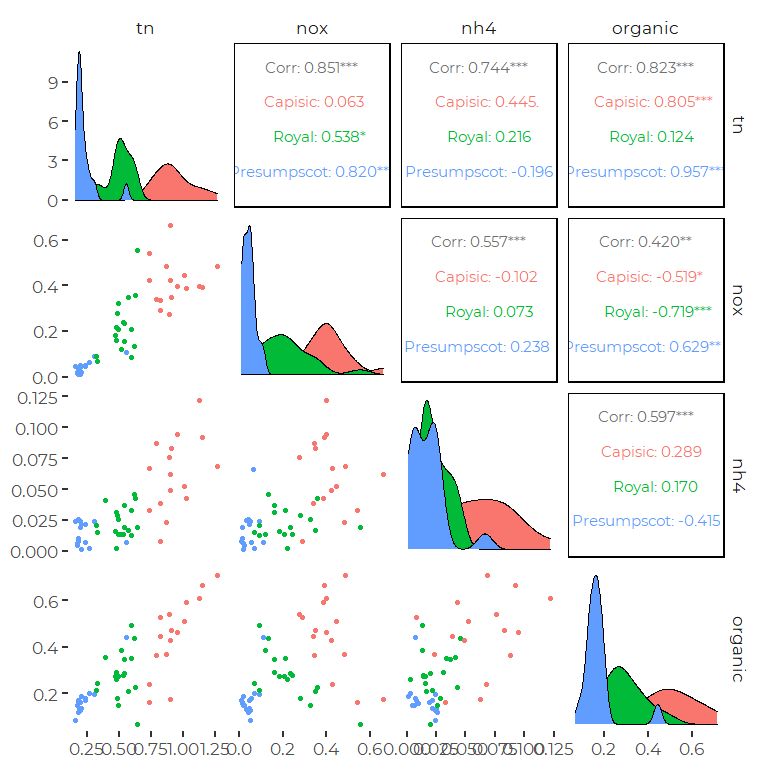
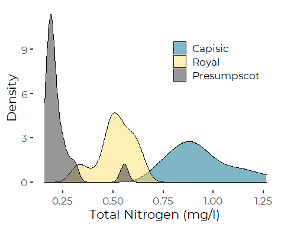
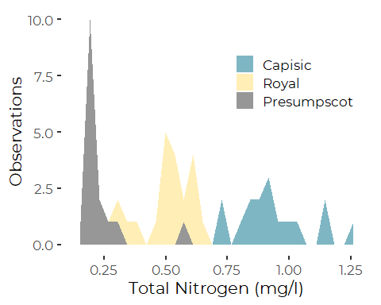
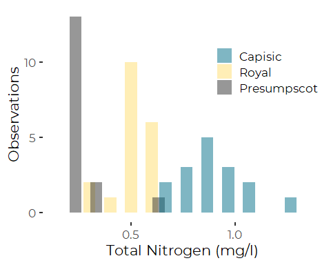
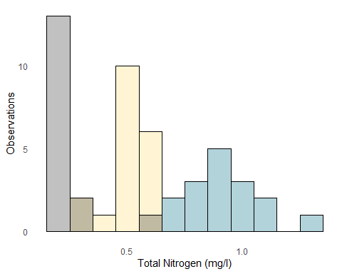
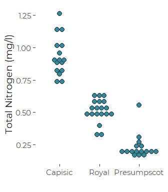

Tributary Nitrogen Concentrations
================
Curtis C. Bohlen, Casco Bay Estuary Partnership.
04/22/2021

-   [Install Libraries](#install-libraries)
-   [Read Data](#read-data)
-   [Exploratory Graphics](#exploratory-graphics)
    -   [Pairs Plot](#pairs-plot)
-   [Alternative Graphics](#alternative-graphics)
    -   [Density Plots](#density-plots)
    -   [Histograms](#histograms)
    -   [Dot Plot](#dot-plot)


# Install Libraries

``` r
library(readxl)
library(tidyverse)
#> -- Attaching packages --------------------------------------- tidyverse 1.3.0 --
#> v ggplot2 3.3.3     v purrr   0.3.4
#> v tibble  3.0.5     v dplyr   1.0.3
#> v tidyr   1.1.2     v stringr 1.4.0
#> v readr   1.4.0     v forcats 0.5.0
#> -- Conflicts ------------------------------------------ tidyverse_conflicts() --
#> x dplyr::filter() masks stats::filter()
#> x dplyr::lag()    masks stats::lag()
library(GGally)
#> Registered S3 method overwritten by 'GGally':
#>   method from   
#>   +.gg   ggplot2

library(CBEPgraphics)
load_cbep_fonts()
theme_set(theme_cbep())
```

# Read Data

``` r
sibfldnm <- 'Original_Data'
parent <- dirname(getwd())
sibling <- paste(parent,sibfldnm, sep = '/')
fn <- '2017-18 Casco Bay Tributary Nitrogen Concentrations.xlsx'

dir.create(file.path(getwd(), 'figures'), showWarnings = FALSE)
```

``` r
the_data <- read_excel(file.path(sibling, fn), 
                       col_types = c("date", "numeric", "numeric", 
                                     "numeric", "numeric"), skip = 1) %>%
  filter( ! is.na(Date)) %>%
  rename(dt = Date,
         tn = `TN (mg/l)`,
         nox = `NOx (mg/L)`,
         nh4 = `NH4 (mg/L)`,
         organic = `Organic (mg/L)`) %>%
  mutate(dt = as.Date(dt))
```

``` r
the_data$tributary <- c(rep('Presumpscot',17), 
                        rep('Royal', 19), 
                        rep('Capisic', 16))
the_data <- the_data %>%
  relocate(tributary) %>%
  mutate(tributary = factor(tributary, levels = c('Capisic', 'Royal', 'Presumpscot')))
```

# Exploratory Graphics

## Pairs Plot

``` r
plt <- ggpairs(the_data[3:6], 
               mapping = aes(color =the_data$tributary), progress = FALSE)
plt
#> Warning: Removed 1 rows containing non-finite values (stat_density).
#> Warning in ggally_statistic(data = data, mapping = mapping, na.rm = na.rm, :
#> Removed 2 rows containing missing values
#> Warning in ggally_statistic(data = data, mapping = mapping, na.rm = na.rm, :
#> Removing 1 row that contained a missing value

#> Warning in ggally_statistic(data = data, mapping = mapping, na.rm = na.rm, :
#> Removing 1 row that contained a missing value
#> Warning: Removed 2 rows containing missing values (geom_point).
#> Warning: Removed 1 rows containing non-finite values (stat_density).
#> Warning in ggally_statistic(data = data, mapping = mapping, na.rm = na.rm, :
#> Removing 1 row that contained a missing value
#> Warning in ggally_statistic(data = data, mapping = mapping, na.rm = na.rm, :
#> Removed 2 rows containing missing values
#> Warning: Removed 1 rows containing missing values (geom_point).

#> Warning: Removed 1 rows containing missing values (geom_point).
#> Warning in ggally_statistic(data = data, mapping = mapping, na.rm = na.rm, :
#> Removing 1 row that contained a missing value
#> Warning: Removed 1 rows containing missing values (geom_point).
#> Warning: Removed 2 rows containing missing values (geom_point).
#> Warning: Removed 1 rows containing missing values (geom_point).
#> Warning: Removed 1 rows containing non-finite values (stat_density).
```



Quickly reviewing that, you see:  
1. TN is quite distinct among all three sources. The Presumpscot has
very low values for all parameters.  
2. Ammonium is lower in the rivers, and higher at Capisic – although
given small sample sizes, that may not be statistically significant.

# Alternative Graphics

## Density Plots

``` r
plt <- ggplot(the_data, aes(x=tn, y = ..density.., fill= tributary)) + 
  geom_density(alpha = 0.5) +
  scale_fill_manual(values=cbep_colors(), name = '') +
  xlab("Total Nitrogen (mg/l)") + 
  ylab("Density") +
  theme(legend.position = c(0.75, 0.75))
plt
#> Warning: Removed 1 rows containing non-finite values (stat_density).
```



``` r
ggsave('figures/densityplot.pdf', device = cairo_pdf, width = 5, height = 4)
#> Warning: Removed 1 rows containing non-finite values (stat_density).
```

``` r
plt <- ggplot(the_data, aes(x=tn, fill = tributary)) + 
  geom_area(aes(fill = tributary), stat = "bin", alpha = 0.5) +
  scale_fill_manual(values=cbep_colors(), name = '') +
  xlab("Total Nitrogen (mg/l)") + 
  ylab("Observations") +
  theme(legend.position = c(0.75, 0.75))
plt
#> `stat_bin()` using `bins = 30`. Pick better value with `binwidth`.
#> Warning: Removed 1 rows containing non-finite values (stat_bin).
```



``` r
ggsave('figures/densitypoly.pdf', device = cairo_pdf, width = 5, height = 4)
#> `stat_bin()` using `bins = 30`. Pick better value with `binwidth`.
#> Warning: Removed 1 rows containing non-finite values (stat_bin).
```

## Histograms

Histograms are a bit more “honest”, since they don’t bury the tiny
sample size. But neither of these are particularly attractive from a
design perspective.

``` r
plt <- ggplot(the_data, aes(x=tn, fill= tributary)) +
  geom_histogram(position = position_dodge2(preserve = "single", padding = -0.75),
                 alpha = 0.5, 
                 binwidth = 0.1) + 
   scale_fill_manual(values=cbep_colors(), name = '') +
  xlab('Total Nitrogen (mg/l)') + 
  ylab('Observations') +
  theme(legend.position = c(0.8, 0.75))
plt
#> Warning: Removed 1 rows containing non-finite values (stat_bin).
```



``` r
ggsave('figures/histogram1.pdf', device = cairo_pdf, width = 5, height = 4)
#> Warning: Removed 1 rows containing non-finite values (stat_bin).
```

``` r
plt <- ggplot(the_data, aes(x=tn, fill= tributary)) +
  geom_histogram(data = subset(the_data, tributary == 'Capisic'),
                 fill = cbep_colors()[1], 
                 alpha = 0.3, 
                 binwidth = 0.1, 
                 color = 'black') +
  geom_histogram(data = subset(the_data, tributary == 'Royal'),
                 fill = cbep_colors()[2], alpha = 0.3, binwidth = 0.1, color = 'black') +
  geom_histogram(data = subset(the_data, tributary == 'Presumpscot'),
                 fill = cbep_colors()[3], alpha = 0.3, binwidth = 0.1, color = 'black') +
  xlab('Total Nitrogen (mg/l)') + ylab('Observations') +
  theme_minimal() +
  theme(panel.grid = element_blank())
plt
#> Warning: Removed 1 rows containing non-finite values (stat_bin).
```



## Dot Plot

``` r
plt <- ggplot(the_data, aes(x=tributary, y = tn)) +
  geom_dotplot(binaxis='y', stackdir='center', 
               binwidth = 0.025, dotsize = 1.5, 
               fill = cbep_colors()[5], color = cbep_colors()[3]) +
                                                              
  ylab('Total Nitrogen (mg/l)') + 
  xlab('') +
    
 # ylim(c(0,1.5)) +
  theme_cbep(base_size = 14)
plt
#> Warning: Removed 1 rows containing non-finite values (stat_bindot).
```



``` r
ggsave('figures/dotplot.pdf', device = cairo_pdf, width = 3.5, height = 2.5)
#> Warning: Removed 1 rows containing non-finite values (stat_bindot).
```
