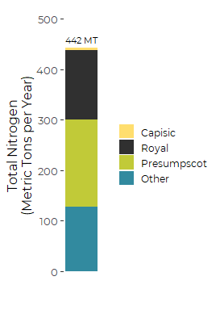

Tributary Nitrogen Concentrations
================
Curtis C. Bohlen, Casco Bay Estuary Partnership.
04/22/2021

-   [Install Libraries](#install-libraries)
-   [Read Data](#read-data)


# Install Libraries

``` r
library(readxl)
library(tidyverse)
#> Warning: package 'tidyverse' was built under R version 4.0.5
#> -- Attaching packages --------------------------------------- tidyverse 1.3.1 --
#> v ggplot2 3.3.3     v purrr   0.3.4
#> v tibble  3.1.2     v dplyr   1.0.6
#> v tidyr   1.1.3     v stringr 1.4.0
#> v readr   1.4.0     v forcats 0.5.1
#> Warning: package 'tidyr' was built under R version 4.0.5
#> Warning: package 'dplyr' was built under R version 4.0.5
#> Warning: package 'forcats' was built under R version 4.0.5
#> -- Conflicts ------------------------------------------ tidyverse_conflicts() --
#> x dplyr::filter() masks stats::filter()
#> x dplyr::lag()    masks stats::lag()

library(CBEPgraphics)
load_cbep_fonts()
theme_set(theme_cbep())
```

# Read Data

``` r
sibfldnm <- 'Derived_Data'
parent <- dirname(getwd())
sibling <- paste(parent,sibfldnm, sep = '/')
fn <- 'summary_tables_from_gray_2019.xlsx'

dir.create(file.path(getwd(), 'figures'), showWarnings = FALSE)
```

``` r
the_data <- read_excel(file.path(sibling, fn), 
    sheet = "Table 3", col_types = c("text", 
        "numeric", "numeric", "numeric", 
        "skip")) %>%
  rename(Tributary = River) %>%
    mutate(Tributary = factor(Tributary, levels = c('Capisic', 'Royal', 'Presumpscot', "Other")))
```

fig.width = 3, fig.height = 4} plt &lt;-sum\_data %&gt;% filter(Site !=
‘SAPPI’ & Site != ‘Westbrook’) %&gt;% mutate(Site =
fct\_reorder(factor(Site), tn\_load\_avg, .desc = TRUE)) %&gt;%

ggplot(aes(Site, tn\_load\_avg)) + geom\_col(fill = cbep\_colors()\[5\])
+

\#scale\_y\_log10() + ylab(‘Total Nitrogen (lbs/day)’) +
scale\_color\_manual(values = cbep\_colors(), name = ’‘) +
theme\_cbep(base\_size = 12) + theme(legend.position = ’bottom’,
axis.text.x= element\_text(size = 10, angle =90, hjust = 1, vjust =
0.25)) plt

``` r
total = sum(the_data$`Annual Load`)

ggplot(the_data, aes(1, `Annual Load`, fill = Tributary)) +
  geom_col() +
  
  ylab('Total Nitrogen\n(Metric Tons per Year)')  +
  xlab('') +
  
  scale_fill_manual(values = cbep_colors()[2:6], name = '') +
  theme_cbep(base_size = 12) +
  theme(axis.text.x= element_blank(),
        axis.ticks.x = element_blank(),
        legend.key.size = unit(0.2, 'in'),
        legend.text = element_text(size = 9)) +
  ylim(0, 500) +
  annotate('text', x = 1, y = 1.04 * total, 
           label = paste(round(total), 'MT'), 
           size = 3)
```


